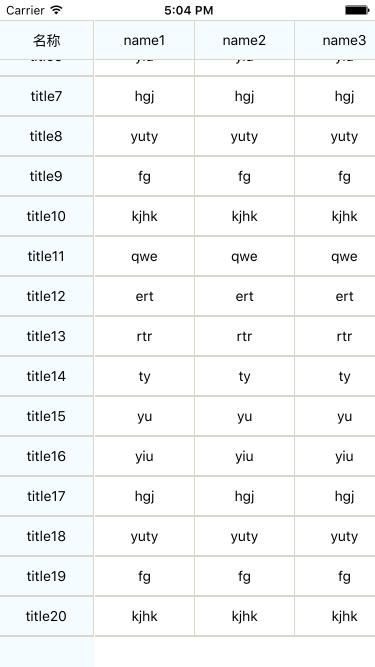
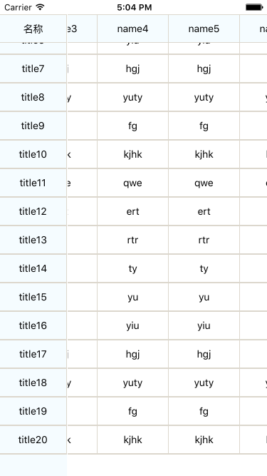

# GirdShow-React-Native
这是一个表格，用于展示数据。左右滑动时，左侧title列不滑动，上下滑动时，顶部name一行不滚动。

## How does it look like?

* Upward sliding

* Sliding to the left

* Normal

## How to run

1. Prepare your environment: [Requirements](http://facebook.github.io/react-native/docs/getting-started.html#requirements) 
2, In iOS Device
3. Clone this repo, and goto the project root directory
4. run `npm install`
5. Enjoy

## Related content

In this project, I used most of technology in React Native:

* Flex Style
* Direct Manipulation
* Native UI Components
* Image/Text/ListView
* TouchableHighlight/TouchableNativeFeedback
* Customize view
* ...
